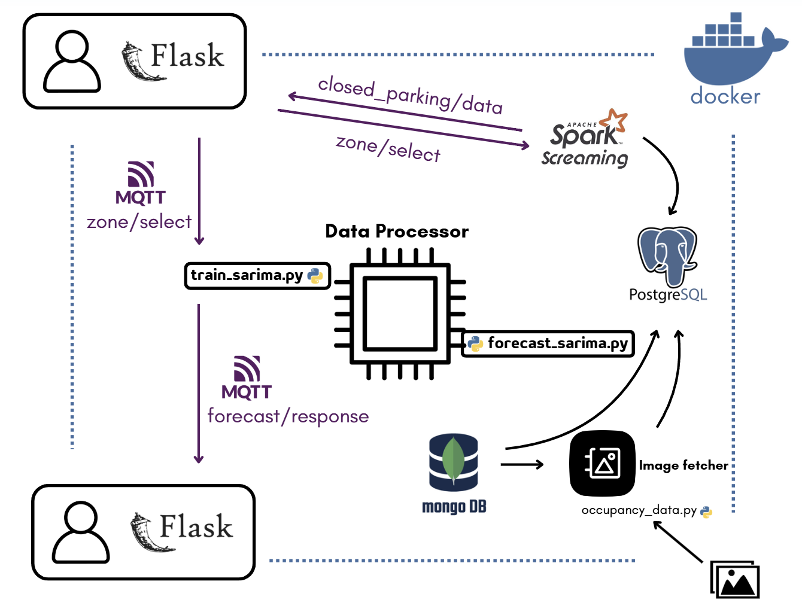

# Smart Parking Management System

Repository for the **Smart Parking Management System**, proposed solution for the Big Data Technologies project by Group 9. It integrates generated real-time sensor data and CCTV-based image recognition to produce predictive analytics to manage and forecast parking availability in a simulated city environment (modeled after Trento, Italy). The system processes, stores, and forecasts parking occupancy while providing users with access to parking data through a Flask-based web interface.
---


---

## Features

- **Image-Based Parking Detection**: Uses a **CNN-based model** to process CCTV images and determine parking occupancy. 
- **Sensor-Based Garage Parking Detection**: Receives live occupancy data from **garage sensors** using **Apache Spark Streaming**.
- **Real-Time Data Processing**: Sensor data is selectively stored in **PostgreSQL** for future analysis. 
- **Historical & Forecasted Occupancy**: Utilizes **SARIMA** models to predict parking occupancy for the next 7 days. 
- **Dynamic Pricing Mechanism**: Adjusts parking fees based on expected demand. 
- **Web-Based User Interface**: Built using **Flask**, allowing users to select a zone and view parking availability. 


---

## Technologies

- **Databases**: MongoDB (for parking metadata), PostgreSQL (for structured occupancy and parking data)
- **Streaming & Processing**: Spark Streaming, Mosquitto MQTT
- **Containerization**: Docker + Docker Compose
- **Web Interface**: Flask
- **Machine Learning**: CNN for image recognition, SARIMA for time-series forecasting

---

## Deployment & Setup

### **Clone the Repository**

```sh
git clone https://github.com/fradimassimo/SmartParkingSystem.git
```

### **Run the Docker Containers**

```sh
docker compose up --build -d
```

### **Set up the databases**
Since data is simulated, run the following commands **on the first build** to populate the DB:

To populate the mongoDB database with parking annotations:
```sh
docker compose run --rm mongo-populate python populate_mongo.py
```
To create the tables in PostreSQL and import the parkings from MongoDB:
```sh
docker compose run --rm postgres-check python check_parkings.py
```
To generate simulated occupancy data that will be stored on PostreSQL and used for the forecast:
```sh
docker compose run --rm postgres-check python processed_data_generator.py
```
To create the garage parking structures that will be stored on PostgreSQL and used to generate streaming data:
```sh
docker compose run --rm spark python garage_parking.py
```

### **Train the Forecast Model Manually**
This command is needed if the file "sarima_model.plk" is not present.
```sh
docker compose run --rm data_processor python train_sarima.py
```

### (Optional) Detect occupancy from images
If you want to check how the parking detection algorithm works, you can run the following command. Data will be automatically stored in PostgreSQL in the occupancy_data table of the smart-parking database. 
It will automatically look for images inside the folder images. It expects data to be divided by parking, with each parking being assigned a folder named parkingXXX, with XXX being the parking id. 
At the moment, it will run the model on 64 images (with 16 different timestamps) from 4 parkings. A bigger dataset with more than 6000 images is present in this repository and can be used by modifying the name of the folder images_full to images.

```sh
docker compose run --rm image-fetcher python parking_occupancy.py
```

### **Access the Web UI**
Open [**http://localhost:5000/**](http://localhost:5000/) in your browser.

### **Access Databases**
To access MongoDB:
```sh
docker exec -it mongodb mongosh
use parking_management
```
To access PostgreSQL:
```sh
docker exec -it postgres psql -U admin -d smart-parking
```

### **Stop Running**

```sh
docker compose down
```

---

## Future Improvements

- **Integrate with Real Data Sources**
- **Develop more efficient models for parking occupancy forecast**
- **Improve the Design of the User Interface**
- **Integrate with Public Transportation to offer alternatives when parkings are close to full capacity**

---

## Authors

- Francesco Di Massimo - [**fradimassimo**](https://github.com/fradimassimo)
- Damiano Zaccaron - [**damianozaccaron**](https://github.com/damianozaccaron)